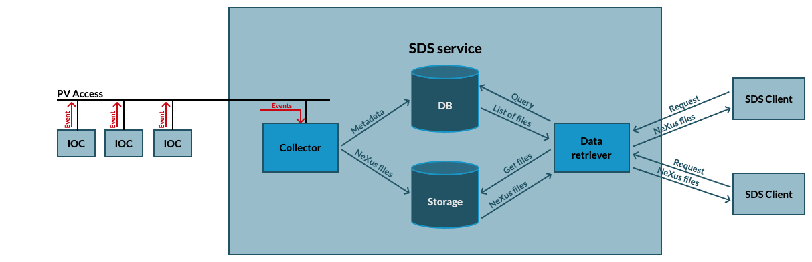

# Synchronous Data Service (SDS)

In this document we briefly describe the architecture of the SDS. It is based on a microservices design, so that it can be easily scaled if needed.

The following diagram shows the different components of the SDS:

- IOCs: the timing system will generate events that will trigger an update of some PVs in the IOCs. These PVs should contain as metadata the event type that triggered the update, the pulse ID, and the timestamp. All this information will be transferred using PV Access. No support for CA is foreseen.

- Collector: it monitors a set of PVs and generates NeXus files for every event. There could be more than one collector instances running at the same time, each of them configured to archive different sets of PVs. For IOCs generating large amounts of data, another service could be run on the IOC that generates NeXus compliant files and communicates with the indexer service.

- Indexer service: it stores metadata in a DB for each dataset received so that the data retriever can search for the files.

- Storage: a distributed network filesystem will be used for data storage. A directory tree structure will be defined to simplify manual retrieval of data.

- Data retriever: connects to the database to search for files. Users can filter by timestamp, pulse ID, event type, or PV(s). It returns one or more NeXus files. This component can also be instantiates multiple times if needed for scalability.

Details of each component can be found here:
- [IOCs](ioc.md)
- [Collector](collector.md)
- [Indexer](indexer.md)
- [Retriever](retriever.md)